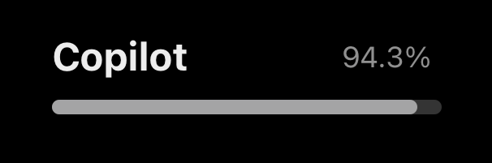

# Scriptable GitHub Copilot quota widget



Create a temporary Scriptable script once to store your token:

```js
const key = 'github-copilot-token';
const value = 'gho_xxxxxx';
Keychain.set(key, value);
```
